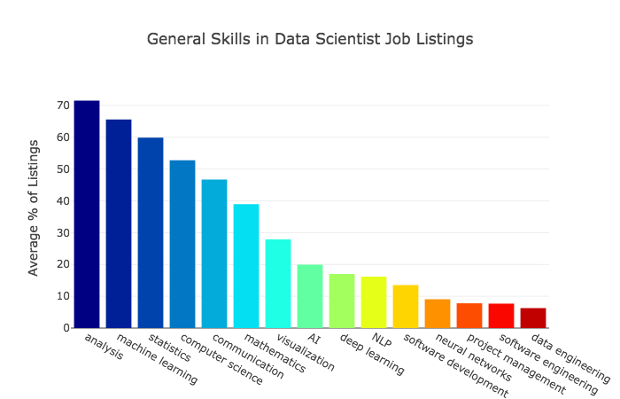

```{r setup, include=FALSE}
knitr::opts_chunk$set(echo = FALSE)
```

```{r loadLibraries, message=FALSE, warning=FALSE, error=FALSE, echo=FALSE}
library(tidyverse)
library(tidytext)
library(ggplot2)
library(wordcloud)
library(RColorBrewer)
library(data.table)
setDTthreads(0L)
```

# “Which are the most valued data science skills?” 

## Scope


- Impossible to answer precisely

- Skills broadly fall into categories

  - Mathematical / Statistical
  - Computers / Coding
  - Communication / Presentation
  - Experimental Design
  - Data Engineering
  
- Data Scientists need Domain Expertise to answer questions
  
# DataScience Exchange

## Data Collection

```{r dsse, echo=FALSE}
# From https://data.stackexchange.com/
# Select the site in question and then pass the following SQL
# SELECT Id, TagName, Count from Tags ORDER BY Count DESC;
DS <- fread("./DSSE/DSSETags.csv", key = "TagName")
```

- Scraped all tags from DataScience Exchange
  - https://data.stackexchange.com/ allows submitting SQL
  - There is an API for automated queries which returns JSONs

```SELECT Id, TagName, Count from Tags ORDER BY Count DESC;```

- There are `r dim(DS)[[1]]` unique tags which range in frequency from
`r min(DS$Count)` to `r max(DS$Count)`. Of these, `r DS[Count > 5, .N]` appear
more than 5 times, `r DS[Count > 100, .N]` more than 100 times, and
`r DS[Count > 1000, .N]` more than 1000 times.

```{r DSSummary, echo=FALSE}
summary(DS %>% select(TagName, Count))
```

## Top 10 tags{.smaller}
```{r DST, echo=FALSE}
# knitr::kable(head(DS[order(-Count)], n = 10))

data <- head(DS[order(-Count)], n = 10)

ggplot(data, aes(reorder(TagName, Count), Count, label=Count, fill = TagName)) +
  geom_col() +
  coord_flip() +
  scale_fill_manual(values = c("#5c55bd", "#5c55bd", "#5c55bd", "#01a607", "#5c55bd", "#5c55bd", "#01a607", "#01a607", "#5c55bd", "#5c55bd")) +
  geom_text(aes(label = Count, y = Count), size = 3, hjust=1.25) +
  labs(x = NULL, y = "Count", title = "Data Science Skills",
     subtitle = "Mined from DataScience Exchange Tags") +
  theme(legend.position = "none",
        plot.title = element_text(hjust = 0.5), 
        plot.subtitle = element_text(hjust = 0.5))

```

<span style="background-color:#01a607; color: #222;">Common Skills</span> we will see again in Dice.com analysis. <span style="background-color:#5c55bd; color: #222;">Unique Skills</span> to only DataScience Exchange Tags.

## Wordcloud (Count > 100)
```{r DSWC, echo=FALSE}
set.seed(2)
wordcloud(DS$TagName,DS$Count, scale = c(4, 0.6), min.freq = 100L,
          colors = brewer.pal(5, "Dark2"), random.color = TRUE,
          random.order = TRUE, rot.per = 0, fixed.asp = FALSE)
```

# Dice.Com
## Data Collection{.smaller}
We used a Jupyter Python notebook to scrape web data:

#### Python Libraries:

* **Selenium** (with Chrome webdriver): automate browsing
* **BeautifulSoup**: mine job links from search results
* **lxml and xpath**: load individual job listings
* **re**: regular expressions to scrape job listing skills
    
    
#### Processing Flow:

1. Run a **search** on Dice.com for **Data Scientist** jobs
2. Loop through **each Results Page**
   + **scrape** each **Job Listing URL** link
3. Loop through each **Job Listing URL link** 
   + **load** the **Job Posting** then **scrape** the **job skill(s)**
4. **Save all skills** to a text file --- one row per job listing

## Results
```{r Dice, echo=FALSE}
Dice <- readChar("./data/dice_ds_skills.txt",
                 file.info("./data/dice_ds_skills.txt")$size)
Dice2 <- gsub("\r\n", " ", Dice, fixed = TRUE)
Dice2 <- gsub('/', " ", Dice2, fixed = TRUE)
Dice2 <- gsub('.', " ", Dice2, fixed = TRUE)
Dice2 <- gsub("&#[0-9]+;", "", Dice2, fixed = FALSE)
Dice2 <- gsub('\"', "", Dice2, fixed = TRUE)
Dice2 <- gsub(" - ", " ", Dice2, fixed = TRUE)
Dice2 <- gsub("^and$", "", Dice2, fixed = TRUE)
Dice2 <- gsub("^or$", "", Dice2, fixed = TRUE)
Dice2 <- gsub("  ", " ", Dice2, fixed = TRUE)
D2 <- data.frame(words = Dice2, stringsAsFactors = FALSE)
DiceTokens <- unnest_tokens(D2, skills, words, token = "regex", pattern = ",")
setDT(DiceTokens)
DiceSkills <- DiceTokens[, .N, by = skills]
```
This data was **significantly less tidy** than the DataScience Exchange tags. After
basic cleanup including removing ampersand-hex codes, punctuation, and obviously
non-skill words such as "and" and "or", the following observations can be made.

<<<<<<< HEAD
There are `r nrow(DiceSkills)` unique tags which range in frequency from
`r DiceSkills[, min(N)]` to `r DiceSkills[, max(N)]`. Of these,
`r nrow(DiceSkills[N > 5])` appear more than 5 times and
`r nrow(DiceSkills[N > 100])` more than 100 times.

There are **`r nrow(DiceSkills)` unique tags** which range in frequency from
**`r DiceSkills[, min(N)]` to `r DiceSkills[, max(N)]`**. Of these,
**`r nrow(DiceSkills[N > 5])`** appear more than **5 times** and
**`r nrow(DiceSkills[N > 100])`** more than **100 times**.

```{r DiceSummary, echo=FALSE}
summary(DiceSkills)
```

## Top 10 tags{.smaller}
```{r DiceT, echo=FALSE}
# knitr::kable(head(DiceSkills[order(-N)], n = 10))

data <- head(DiceSkills[order(-N)], n = 10)

ggplot(data, aes(reorder(skills, N), N, label=N, fill = skills)) +
  geom_col() +
  coord_flip() +
  scale_fill_manual(values = c("#bd7217", "#bd7217", "#bd7217", "#bd7217", "#01a607", "#bd7217", "#01a607", "#01a607", "#bd7217", "#bd7217")) +
  geom_text(aes(label = N, y = N), size = 3, hjust=1.25) +
  labs(x = NULL, y = "Count", title = "Data Science Skills",
     subtitle = "Mined from Dice.com Job Listings") +
  theme(legend.position = "none",
        plot.title = element_text(hjust = 0.5), 
        plot.subtitle = element_text(hjust = 0.5))
```

<span style="background-color:#01a607; color: #222;">Common Skills</span> we saw in DataScience Exchange Tags.  <span style="background-color:#bd7217; color: #222;">Unique Skills</span> to only Dice.com Job Skills.

## Wordcloud (Count > 5)
```{r DiceWC, echo=FALSE}
set.seed(2)
wordcloud(DiceSkills$skills,DiceSkills$N, scale = c(4, 0.6), min.freq = 5L,
          colors = brewer.pal(5, "Dark2"), random.color = TRUE,
          random.order = TRUE, rot.per = 0, fixed.asp = FALSE)
```

## Dice/DS Exchange Comparison
```{r DDSC, echo=FALSE}
Dice10 <- head(DiceSkills[order(-N)], n = 10)
DS10 <- head(DS[order(-Count)], n = 10)
DS10[, TagName := gsub("-", " ", TagName)]
DS10[, Id := NULL]
setnames(DS10, names(DS10), names(Dice10))
```

```{r intersect, echo=FALSE}
shared <- intersect(trimws(DS10$skills), trimws(Dice10$skills))
diff1 <- setdiff(trimws(Dice10$skills), trimws(DS10$skills))
diff2 <- setdiff(trimws(DS10$skills), trimws(Dice10$skills))
```

The following skills are represented in **both** the top 10 DataScience Exchange tags **and** the Dice.com job skills:

- <span style="color:#01a607">`r shared`</span>

The following are **unique** to the **top 10 DataScience exchange tags**:

- <span style="color:#5c55bd">`r diff2`</span>

and conversely these are **unique** to the **top 10 Dice.com job skills**:

- <span style="color:#bd7217">`r diff1`</span>


# Previous Analyses Published Online
## KDNuggets---2018: Description
In November of 2018, Jeff Hale posted an entry on the
[KDNuggets blog](https://www.kdnuggets.com/2018/11/most-demand-skills-data-scientists.html)
where he
described his findings based on a job-listing analysis performed against
LinkedIn, Indeed, SimplyHired, and AngelList on October 10, 2018.

His findings, shown on the next slide, reinforce that the most requested skills
are the analytical ones: computer science, analysis, statistics, and machine
learning as examples. However, there are a number of "softer" skills requested,
such as communications and visualization.

It should be noted that those would not necessarily be found as questions on
DataScience Exchange.

## KDNuggets---2018: Findings


## LinkedIn---2018: Description
In April of 2018, [Michael Li](https://www.linkedin.com/in/limichael), VP of
Data at Coinbase, posted a
[piece on LinkedIn](https://www.linkedin.com/pulse/behind-big-data-ai-elements-modern-science-michael-li/)
where he listed his main desired skills for new data science hires.

- Data wrangling / Munging / Manipulation

- Experiment Design and A/B testing

- Statistical Modeling / Machine learning

- Soft Skills

- Case studies and problem-solving

## LinkedIn---2018: Discussion{.smaller}
What is important about Li's piece is its focus on the "softer" skills of the
data scientist. Of the five headings, only two would be considered classic "hard"
data science: **Data wrangling** and **Statistical modeling**. 

While one could make the case that **Experimental Design** is rigorous as in the
work of Fisher, Neyman, and Pearson, it is a skill which does not receive enough
mention in many discussions.

Li makes it clear that he views developing good **case studies**,
**visualizations**, **after-action summaries**, **communications**, and
**persuasion skills** as key in becoming a good data scientist. He concludes
his section of soft-skills with:

>Ultimately, the goal is to take the insights generated from the analysis and
>effectively influence critical decision-making, which drives business impact.
>The “hard skills” and “soft skills” need to work together for the success of
>a data scientist.
