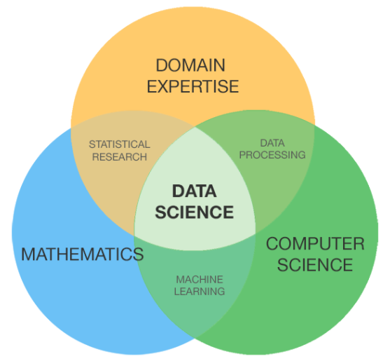

```{r setup, include=FALSE}
knitr::opts_chunk$set(echo = FALSE)
```

```{r loadLibraries, message=FALSE, warning=FALSE, error=FALSE, echo=FALSE}
library(ggplot2)
library(wordcloud)
library(RColorBrewer)
library(data.table)

setDTthreads(0L)
```

# “Which are the most valued data science skills?” 

## Scope



- Impossible to answer precisely

- Skills broadly fall into categories

  - Mathematical / Statistical
  - Computers / Coding
  - Communication / Presentation
  - Experimental Design
  - Data Engineering
  
- Data Scientists often need Domain Expertise to answer questions
  
# DataScience Exchange

## Data Collection

```{r dsse, echo=FALSE}
# From https://data.stackexchange.com/
# Select the site in question and then pass the following SQL
# SELECT Id, TagName, Count from Tags ORDER BY Count DESC;
DS <- fread("./DSSE/DSSETags.csv", key = "TagName")
```

- Scraped all tags from DataScience Exchange
  - https://data.stackexchange.com/ allows submitting SQL
  - There is an API for automated queries which returns JSONs

```SELECT Id, TagName, Count from Tags ORDER BY Count DESC;```

- There are `r dim(DS)[[1]]` unique tags which range in frequency from
`r min(DS$Count)` to `r max(DS$Count)`. Of these, `r DS[Count > 5, .N]` appear
more than 5 times, `r DS[Count > 100, .N]` more than 100 times, and
`r DS[Count > 1000, .N]` more than 1000 times.

## Top 10 tags{.smaller}
```{r T, echo=FALSE}
knitr::kable(head(DS[order(-Count)], n = 10))
```

## Wordcloud (Count > 100)
```{r DSWC, echo=FALSE}
set.seed(2)
wordcloud(DS$TagName,DS$Count, scale = c(4, 0.6), min.freq = 100L,
          colors = brewer.pal(5, "Dark2"), random.color = TRUE,
          random.order = TRUE, rot.per = 0, fixed.asp = FALSE)
```


# Other Skills
## Need to expand
 * https://www.linkedin.com/pulse/behind-big-data-ai-elements-modern-science-michael-li/
 * https://www.kdnuggets.com/2018/11/most-demand-skills-data-scientists.html
 * https://news.microsoft.com/stories/people/james-mickens.html 


